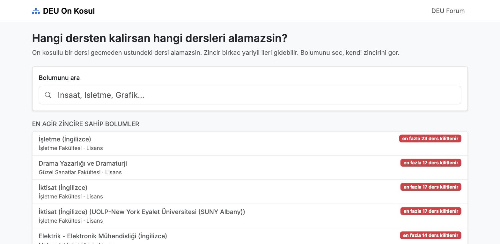
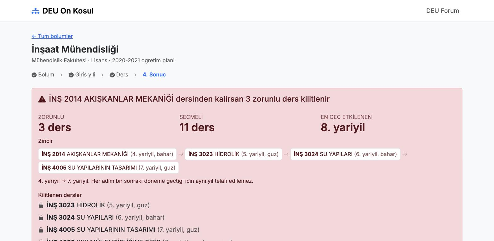
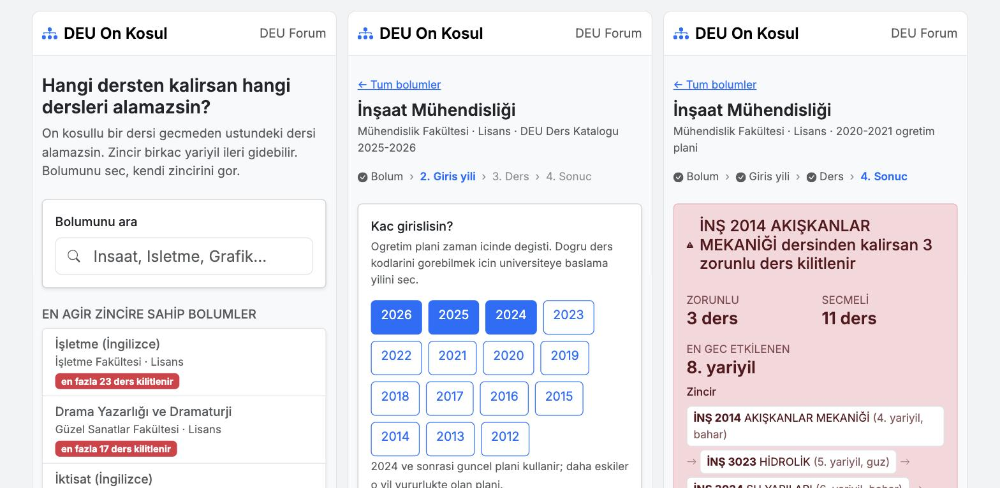

# DEÜ Ön Koşul

Dokuz Eylül Üniversitesi'nde hangi dersten kalırsan hangi dersleri alamazsın.

**Canlı: [onkosul.kadiray.com](https://onkosul.kadiray.com)**

Giriş yok, transkript yok, kullanıcı verisi yok. Tek bir soruyu cevaplar.



## Sorun

Notlar DEBİS'te, ön koşullar başka yerde, ikisini birleştiren hiçbir şey yok.
Öğrenci hangi dersi neden alamadığını ders kayıt haftasında, iş işten geçtikten
sonra öğreniyor. Karar penceresi yılda dört gün.

Mevcut çözüm: üst sınıflara sormak ya da internette aramak.

## Ne gösteriyor

Bölümünü seç, kaç girişli olduğunu söyle, kaldığın dersi işaretle. Gerisi çıkıyor.



İnşaat Mühendisliği, 2021 girişli, Akışkanlar Mekaniği'nden kalan bir öğrenci için:

```
İNŞ 2014 AKIŞKANLAR MEKANİĞİ       (4. yarıyıl, bahar)
  → İNŞ 3023 HİDROLİK              (5. yarıyıl, güz)
  → İNŞ 3024 SU YAPILARI           (6. yarıyıl, bahar)
  → İNŞ 4005 SU YAPILARININ TASARIMI (7. yarıyıl, güz)
```

3 zorunlu, 11 seçmeli ders kilitleniyor. Her adım bir sonraki döneme geçtiği
için aynı yıl telafi edilemiyor.

## Üç tasarım kararı

**Zorunlu ile seçmeli ayrı sayılır.** "15 ders kilitlenir" felaket gibi okunuyor,
oysa çoğu seçmeli. Seçmeliyi alamamak başkasını seçmek, zorunluyu alamamak mezun
olamamak demek.

**Sayı yerine zincirin kendisi gösterilir.** "Zincir 3 adım" kimseye bir şey
anlatmıyor; yolu göstermek anlatıyor.

**Giriş yılı sorulur.** Planlar değişiyor. İnşaat 2024'te derslerini yeniden
numaralandırdı: Akışkanlar `İNŞ 2014` iken `İNŞ 2114`, Yapı Dinamiği `İNŞ 4009`
iken `İNŞ 4109` oldu. 2021 girişli bir öğrencinin transkriptinde eski kodlar
yazar ve o plan daha sıkıydı: aynı dersten kalmak 3 değil 15 dersi kilitliyordu.

## Mobil



390px'te doğrulandı: yatay taşma yok, tablo ve zincir kaydırma kabında, 44px
altında dokunma hedefi yok.

## Veri

Kaynak: DEÜ Ders Kataloğu / Bilgi Paketi, her dersin sayfasındaki
**"Dersin Önkoşulu/Önkoşulları"** alanı.

| | |
|---|---|
| Program | 647 |
| Zinciri olan program | 125 |
| Ön koşullu ders | 990 |
| Yalnız metin şartı (örn. hazırlık sınıfı) | 5 program |
| Veri boyutu | 688 KB |

Ön koşul en yoğun Güzel Sanatlar'da (354 ders) ve İşletme'de (263), Mühendislik
üçüncü sırada (143).

Sekiz fakülte hiç ön koşul tanımlamamış (Tıp ve Hukuk dahil). O sayfalar bunu
açıkça söyler, **"ön koşul yok" demez**: katalogda tanımlı olmaması, fakültenin
kendi esaslarında uygulamadığı anlamına gelmiyor.

### Eski plan sürümleri

```
npm run archive    # eng.deu.edu.tr plan PDF arşivi -> public/data/plans
```

Kaynak `eng.deu.edu.tr`; `robots.txt`'i yalnızca `/wp-includes/` kapatıyor.
`debis`'in yasaklı katalog yıllarına dokunulmuyor.

Kapsam yalnızca **Mühendislik Fakültesi** (12 program, 49 sürüm). Diğer
fakülteler ya arşiv yayınlamıyor (İşletme, İİBF) ya da `robots.txt` ile kapatmış
(Güzel Sanatlar). Arşivi olmayan bölümlerde yıl adımı atlanır ve sayfa bunu söyler.

Plan PDF'lerinde "hangi dönem açılır" sütunu yok; yarıyıl tekliğinden türetiliyor.
Kural katalogla sınandı: **13.599 lisans dersinde sıfır istisna** (tek yarıyıl güz,
çift yarıyıl bahar).

### Kazıma

Kazıma tek yerde: `dokuzeylul-analyzer`'daki `tools/scraper/scrape.py`.
Bu depo onun çıktısından ince bir set üretir:

```
npm run data                            # ../dokuzeylulanalyzer/public/data
DEU_CATALOG_DIR=/başka/yol npm run data
```

Üretilen `public/data` commit edilir; uygulama çalışma anında analyzer'a bağımlı
değildir.

## Kanıt

Her iddia DEÜ'nün kendi sayfasına bağlanır. "Detayı göster" altındaki **Kaynak**
kartında:

- **Kural:** Öğretim ve Sınav Uygulama Esasları MADDE 6/5 — *"Bir derse ön şart
  olan ders veya dersler başarılmış olmadıkça o ders alınamaz."*
- **Plan:** arşiv sürümünde fakültenin yayınladığı PDF, güncelde katalog sayfası
- **Ders:** o dersin katalog sayfası, "Dersin Önkoşulu alanına bak" notuyla

## Doğrulama kapıları

`npm run archive` şu durumda hata koduyla durur: aynı döneme ait bir plan PDF'i,
katalogda **olmayan** bir ön koşul iddia ederse. Bu, ayrıştırıcının sahte
bağlantı üretmesini yakalar.

`npm run data` hiçbir programda ön koşul bulamazsa durur.

## Akış

```
/program/:id                       1) Bölüm onayı
/program/:id/yil                   2) Giriş yılı   (arşiv yoksa atlanır)
/program/:id/yil/:year/ders        3) Hangi dersten kaldın
/program/:id/yil/:year/ders/:code  4) Sonuç
```

Ekranda aynı anda tek soru. Sıralama tablosu ve zincir haritası sonuç ekranında
"Detayı göster" altında durur. Her adımın kendi adresi var: paylaşılabilir, geri
tuşu çalışır, prerender edilebilir.

## Görünüm

Forumla (NodeBB Harmony) aynı: Bootstrap 5, Inter, `--bs-primary #0d6efd`,
`--bs-border-radius 0.375rem`. Ek tema katmanı yok.

## SEO

`npm run build` şunları üretir:

- `dist/program/<id>/index.html` — bölümün zinciri, düz metin
- `dist/program/<id>/yil/guncel/ders/<slug>/index.html` — "X dersinden kalırsan
  ne olur" sonuç sayfası, her ön koşullu ders için bir tane (**803 adet**)
- `sitemap.xml` (1451 adres) ve `robots.txt`
- her sayfada `canonical`, Open Graph, Twitter kartı
- sonuç sayfalarında `FAQPage` yapısal verisi
- sihirbazın ara adımları `noindex`, sitemap dışı

Gövde JavaScript çalışmadan okunur, arama motoru zinciri olduğu gibi görür.

> Başka bir alan adına deploy ederken `SITE_URL` ver, yoksa `canonical` yanlış
> adresi gösterir.

## Komutlar

```
npm run dev        # 5174
npm test           # vitest
npm run data       # ince veri setini üret
npm run archive    # eski plan sürümlerini çek
npm run build      # tsc + vite + prerender
npm run deploy     # Cloudflare Pages
```

## Yığın

React 18, TypeScript, Vite, React Bootstrap, React Router. Cloudflare Pages.
Çalışma anında sunucu yok, veritabanı yok, çerez yok.

## Sınırlar

DEÜ'nün *"öğrenci giriş yılının planına tabidir"* diye yazılı bir kuralı
bulunamadı; Muafiyet ve İntibak Yönergesi yatay geçiş ve dışarıdan alınan dersler
içindir. Bu yüzden ürün **"senin giriş yılında yürürlükte olan plan buydu"** der,
*"sana bu plan uygulanır"* demez.

76 ders detay sayfası katalogun kendisinde HTTP 404 veriyor, hepsi yüksek lisans
programlarında. Lisans verisi eksiksiz.

Resmi bir DEÜ uygulaması değildir. Kesin bilgi için danışmanınıza ve kayıt
ekranına bakın.
